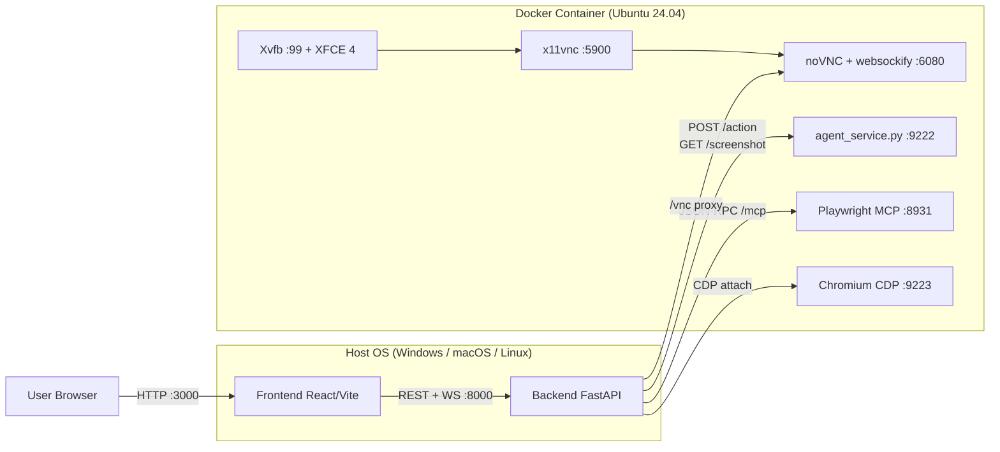
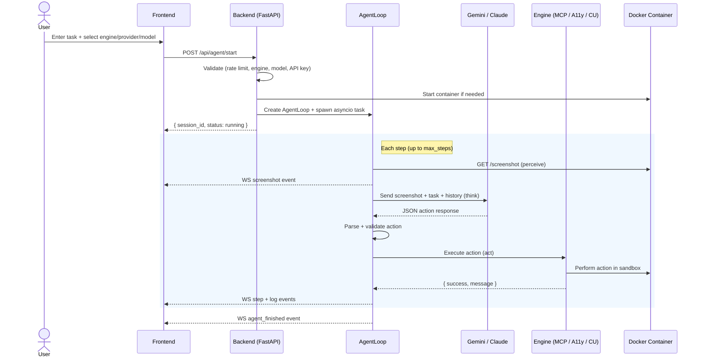
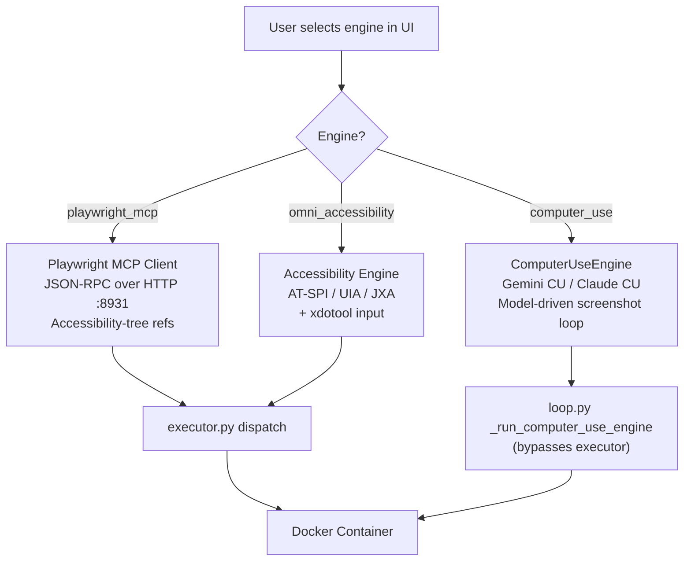
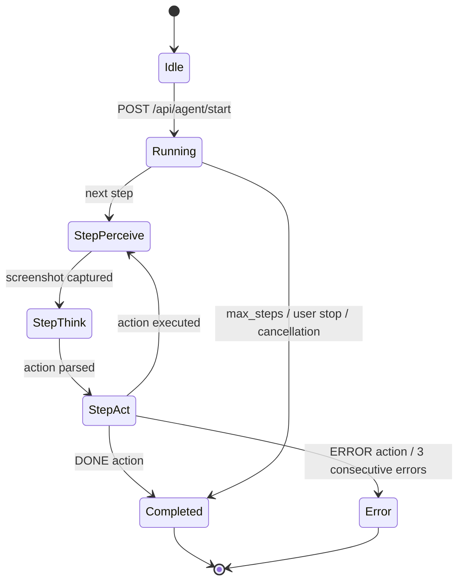

<div align="center">

# 🖥️ CUA Workbench

### Computer-Using Agent Workbench

[](https://python.org)
[](https://fastapi.tiangolo.com)
[](https://react.dev)
[](https://docker.com)
[](https://playwright.dev)
[](LICENSE)

A cross-platform workbench for building and testing **computer-using agents**.
Run a full **Linux desktop + browser inside Docker**, stream it live in a **web UI**,
and drive it with **native Computer Use protocols** (Gemini / Claude) or **Playwright MCP**.

[Quickstart](#-quickstart) · [Architecture](#-architecture) · [API Reference](#-api--websocket) · [Configuration](#-configuration)

</div>

---

## 📑 Table of Contents

| | | |
|---|---|---|
| 1. [Overview](#-overview) | 7. [API & WebSocket](#-api--websocket) | 13. [Troubleshooting](#-troubleshooting) |
| 2. [Key Features](#-key-features) | 8. [Quickstart](#-quickstart) | 14. [Security Notes](#-security-notes) |
| 3. [Architecture](#-architecture) | 9. [Configuration](#-configuration) | 15. [Project Structure](#-project-structure) |
| 4. [Engines](#-engines) | 10. [Usage](#-usage) | 16. [License](#-license) |
| 5. [Agent Loop](#-agent-loop) | 11. [Testing](#-testing) | |
| 6. [Data Model](#-data-model) | 12. [Docker Runtime](#-docker-runtime) | |

---

## 🔭 Overview

CUA Workbench implements a **perceive → think → act** loop for autonomous computer control. It captures a screenshot of a virtual Linux desktop running inside Docker, sends the image to a vision-language model (Gemini or Claude) alongside the user's task, receives a structured action command, and executes that command inside the sandbox. This cycle repeats until the task is completed, an error is unrecoverable, or the step limit is reached.

The system provides a React-based web UI for starting sessions, selecting engines/models, observing the desktop in real time (via WebSocket screenshot stream, WebRTC, or noVNC), and reviewing step-by-step action logs.

---

## ✨ Key Features

- **Three automation engines** — Playwright MCP (accessibility-tree browser control), Omni Accessibility (AT-SPI/UIA desktop automation), Computer Use (Gemini/Claude native CU protocol)
- **Multi-provider AI** — Google Gemini and Anthropic Claude, with a model allowlist enforced at the API layer (`backend/allowed_models.json`)
- **Safe Docker sandbox** — all automation runs inside an Ubuntu 24.04 container with resource limits, `no-new-privileges`, and localhost-only port bindings
- **Real-time streaming** — live screenshot stream via WebSocket, optional WebRTC video (ffmpeg x11grab + aiortc), interactive noVNC desktop access
- **Cross-platform host** — backend + frontend run on Windows, macOS, or Linux; the Docker container provides the Linux desktop
- **Failure recovery** — consecutive error tracking (3-strike abort), duplicate action detection with engine-aware thresholds, recovery hint injection
- **Comprehensive input validation** — rate limiting (10 starts/min), concurrent session cap (3), coordinate/text bounds checking, engine/provider/model allowlists
- **461+ hermetic tests** — unit and stress tests using mocks, no network or container required

---

## 🏗️ Architecture

The system is a **three-process architecture** spanning the host and a Docker container:

| Layer | Technology | Entry Point | Port |
|---|---|---|---|
| **Backend** | Python / FastAPI / Uvicorn | `backend/main.py` → `backend.api.server:app` | `8000` |
| **Frontend** | React 19 / Vite 6 / React Router 7 | `frontend/src/main.jsx` | `3000` |
| **Container** | Ubuntu 24.04 / XFCE 4 / Xvfb / Playwright | `docker/entrypoint.sh` → `docker/agent_service.py` | `9222` |

### High-Level Architecture Diagram



### Agent Session Sequence Diagram



### Engine Selection Flowchart



### Communication Protocols

| Path | Protocol | Source → Target |
|---|---|---|
| Frontend → Backend (REST) | HTTP | `api.js` → `server.py` endpoints |
| Frontend → Backend (live events) | WebSocket | `useWebSocket.js` → `/ws` in `server.py` |
| Frontend → Backend (video) | WebRTC | `ScreenView.jsx` → `/webrtc/offer` → `webrtc_server.py` |
| Frontend → Container (VNC) | noVNC (WebSocket) | `ScreenView.jsx` → `/vnc/websockify` proxy in `server.py` |
| Backend → Agent Service | HTTP POST/GET | `executor.py` → `:9222/action`, `screenshot.py` → `:9222/screenshot` |
| Backend → Playwright MCP | JSON-RPC over HTTP | `playwright_mcp_client.py` → `:8931/mcp` |
| Backend → Docker CLI | Subprocess | `docker_manager.py` → `docker build/run/rm/exec` |

---

## ⚙️ Engines

Three engines are defined in `SUPPORTED_ENGINES` (sourced from `backend/engine_capabilities.json`):

### 1. Playwright MCP — Semantic Browser Automation

| | |
|---|---|
| **Dispatch** | `executor.py` → `playwright_mcp_client.py` → JSON-RPC over HTTP to `:8931/mcp` |
| **Runtime** | Standalone `@playwright/mcp` server managing its own Chromium instance |
| **Targeting** | Accessibility-tree snapshot refs (`[ref=S12]`), not pixel coordinates |
| **Actions** | `browser_navigate`, `browser_click`, `browser_type`, `browser_fill_form`, `browser_snapshot`, `browser_evaluate`, `browser_tabs`, and 15 more (see `engine_capabilities.json`) |
| **Direct path** | When the model provides `tool_args`, arguments are passed verbatim via `execute_mcp_action_direct()` — no ref resolution or JS fallback |
| **Legacy path** | When `tool_args` is absent, flat `(action, target, text)` fields are translated into MCP parameters via `_build_mcp_args()` |

### 2. Omni Accessibility — Cross-Platform Desktop Automation

| | |
|---|---|
| **Dispatch** | `executor.py` → `accessibility_engine.py` → AT-SPI2 (Linux) / UI Automation (Windows) / JXA (macOS) + xdotool for physical input |
| **Runtime** | Platform auto-detected via GObject Introspection (Linux), PowerShell UIA (Windows), osascript JXA (macOS) |
| **Actions** | Find elements by role/name/state, click by element ID, type into focused elements, get accessibility tree, window activation |
| **Features** | TTL element cache, circuit breaker, semantic scoring, post-action verification, cross-platform provider abstraction |
| **Requirements** | Linux: `at-spi2-core`, `python3-gi`, D-Bus · Windows: PowerShell 5.1+ · macOS: Accessibility permissions |

### 3. Computer Use — Native CU Protocol (Gemini / Claude)

| | |
|---|---|
| **Dispatch** | `loop.py` → `_run_computer_use_engine()` → `ComputerUseEngine.execute_task()` (bypasses `executor.py` — the model controls the action loop) |
| **Providers** | **Gemini**: normalized 0–999 coordinates, denormalized to pixels by executor · **Claude**: real pixel coordinates, tool version auto-detected from `allowed_models.json` metadata |
| **Execution modes** | Browser (via Playwright CDP page) or Desktop (via xdotool + scrot) |
| **Actions** | `click_at`, `type_text_at`, `key_combination`, `scroll_at`, `drag_and_drop`, `navigate`, `screenshot`, `done`, and more |
| **Features** | Model-driven screenshot loop, safety decision handling (`require_confirmation`), inline base64 screenshot feedback, thinking/reasoning traces |
| **Constraint** | Docker execution target only — `POST /api/agent/start` returns 400 if `engine=computer_use` with `execution_target=local` |

---

## 🔄 Agent Loop

### Core Loop (`backend/agent/loop.py`)

`AgentLoop.run()` executes up to `max_steps` iterations (default 50, hard cap 200). Each step runs through `_execute_step()` with a per-step timeout (default 30s):

1. **Perceive** — capture screenshot via agent service or `docker exec scrot` fallback
2. **Think** — send screenshot + task + last 15 actions to the LLM
3. **Parse** — strip markdown fences, extract JSON, resolve action aliases, validate `ActionType`
4. **Act** — validate → normalize → dispatch to engine
5. **Loop or terminate** — continue on success; abort on `done`, `error`, 3 consecutive errors, user stop request, or max steps

### Failure Recovery

| Mechanism | Details |
|---|---|
| **Consecutive error tracking** | Counter increments on error, resets on success. At 3 errors, session aborts. |
| **Duplicate action detection** | Compares last N actions (browser: 3, desktop: 2) for same type/coordinates/text. If stuck, injects a `WAIT` action with a recovery hint. |
| **Stuck detection limit** | After 3 stuck-detection firings, the loop force-terminates. |
| **Duplicate result detection** | If last 2+ execution results are identical, an ultimatum to return `done`/`error` is injected. |
| **Recovery hints** | Engine-specific advice (e.g., stuck `CLICK` → try `evaluate_js` or `key Enter`). |

### State Machine



---

## 💾 Data Model

### Key Models (`backend/models.py`)

**`AgentAction`** — structured action returned by the LLM:

| Field | Type | Purpose |
|---|---|---|
| `action` | `ActionType` enum | One of 200+ action types across all engines |
| `target` | `str` or `None` | CSS selector, element name, or description |
| `coordinates` | `list[int]` or `None` | `[x, y]` or `[x1, y1, x2, y2]` (max 4 values) |
| `text` | `str` or `None` | Input text, URL, key name, or JS code |
| `reasoning` | `str` or `None` | Model's explanation for this action |
| `tool_args` | `dict` or `None` | MCP-native arguments — passed verbatim to `session.call_tool()` when present |

**`StartTaskRequest`** — validated request body for `POST /api/agent/start`:

| Field | Type | Constraints |
|---|---|---|
| `task` | `str` | Required, max 10,000 chars |
| `api_key` | `str` or `None` | Optional (resolved from env if empty), max 256 chars |
| `model` | `str` | Max 64 chars, validated against allowlist |
| `max_steps` | `int` | 1–200, default 50 |
| `mode` | `str` | `browser` or `desktop` |
| `engine` | `str` | Required — `playwright_mcp`, `omni_accessibility`, or `computer_use` |
| `provider` | `str` | `google` or `anthropic` |
| `execution_target` | `str` | `local` or `docker` (default `local`) |
| `system_prompt` | `str` or `None` | Optional custom prompt, max 50,000 chars |
| `allowed_domains` | `list[str]` or `None` | Optional domain allowlist, max 50 entries |

**`AgentSession`**, **`StepRecord`**, **`TaskStatusResponse`**, **`LogEntry`**, **`StructuredError`** — see `backend/models.py` for full definitions.

### In-Memory State

All session state lives in memory (`backend/api/server.py`). No persistent database is used — state is lost on backend restart.

```python
_active_loops: dict[str, AgentLoop] = {}   # session_id → AgentLoop instance
_active_tasks: dict[str, asyncio.Task] = {} # session_id → asyncio.Task
_ws_clients: list[WebSocket] = []           # connected WebSocket clients
```

---

## 📡 API & WebSocket

### REST Endpoints (`backend/api/server.py`)

| Method | Path | Purpose |
|---|---|---|
| `GET` | `/api/health` | Liveness probe |
| `GET` | `/api/container/status` | Docker container + agent service health |
| `POST` | `/api/container/start` | Build-if-needed and start the container |
| `POST` | `/api/container/stop` | Stop all agents then remove container |
| `POST` | `/api/container/build` | Trigger Docker image build |
| `GET` | `/api/agent-service/health` | Check if agent service is responding |
| `POST` | `/api/agent-service/mode` | Switch agent service mode (`browser`/`desktop`) |
| `GET` | `/api/keys/status` | API key availability per provider (masked preview) |
| `GET` | `/api/models` | Canonical model allowlist for UI dropdowns |
| `GET` | `/api/engines` | Available engines for UI dropdowns |
| `GET` | `/api/screenshot` | Current screenshot as base64 PNG |
| `POST` | `/api/agent/start` | Start a new agent session |
| `POST` | `/api/agent/stop/{session_id}` | Stop a running session |
| `GET` | `/api/agent/status/{session_id}` | Session status + last action |
| `GET` | `/api/agent/history/{session_id}` | Full step history (without screenshots) |
| `POST` | `/api/agent/safety-confirm` | Respond to CU engine safety confirmation prompt |
| `POST` | `/webrtc/offer` | WebRTC SDP offer/answer negotiation |
| `GET` | `/vnc/{path}` | noVNC static file proxy |
| `WS` | `/vnc/websockify` | noVNC WebSocket proxy to container websockify |

### WebSocket Events (`/ws`)

Broadcast to all connected clients:

| Event | Payload | Trigger |
|---|---|---|
| `screenshot` | `{ screenshot: base64 }` | Each agent step |
| `screenshot_stream` | `{ screenshot: base64 }` | Periodic desktop capture (interval: `ws_screenshot_interval`) |
| `log` | `{ log: LogEntry }` | Agent log emission |
| `step` | `{ step: StepRecord }` | Each step completion (without screenshots/raw response) |
| `agent_finished` | `{ session_id, status, steps }` | Agent loop termination |
| `pong` | `{}` | Response to client `ping` |

Client → Server: `{ type: "ping" }` for keepalive (sent every 15s by `useWebSocket.js`).

---

## 🚀 Quickstart

### Prerequisites

- **Docker** with BuildKit support
- **Python 3.10+**
- **Node.js 18+**

### Option A — Automated Setup

**Windows:**
```bat
setup.bat
```

**Linux / macOS:**
```bash
bash setup.sh
```

Both scripts verify prerequisites → build Docker image → create Python venv → install pip dependencies → install frontend npm packages.

### Option B — Manual Setup

```bash
# 1. Build Docker image
docker build -t cua-ubuntu:latest -f docker/Dockerfile .

# 2. Python backend
python -m venv .venv
# Windows: .venv\Scripts\activate
# Linux/macOS: source .venv/bin/activate
pip install --upgrade pip
pip install -r requirements.txt

# 3. Frontend
cd frontend && npm install && cd ..

# 4. API key (at least one required)
# Option A: .env file in project root
echo "GOOGLE_API_KEY=your-key-here" >> .env
# Option B: system environment variable
# Option C: paste directly in the UI at runtime
```

### Running

<table>
<tr><td>

**① Docker container**
```bash
docker compose up -d
```
Health check: `curl http://127.0.0.1:9222/health`

</td><td>

**② Backend** (new terminal)
```bash
python -m backend.main
```

</td></tr>
<tr><td>

**③ Frontend** (new terminal)
```bash
cd frontend && npm run dev
```

</td><td>

**④ Open the Workbench**
- 🌐 UI: [http://127.0.0.1:3000](http://127.0.0.1:3000)
- 📺 noVNC: [http://127.0.0.1:6080](http://127.0.0.1:6080)

</td></tr>
</table>

> 💡 **Windows note:** Prefer `127.0.0.1` over `localhost` to avoid IPv6 binding issues with Docker.

> If you skip `docker compose up -d`, the container starts automatically when you launch an agent task from the UI.

---

## 📝 Configuration

### API Keys

Keys are resolved in priority order:
1. **UI input** — paste in the Workbench
2. **`.env` file** — `GOOGLE_API_KEY` or `ANTHROPIC_API_KEY` in project root
3. **System environment variable** — same variable names

### Allowed Models (`backend/allowed_models.json`)

| Provider | Model ID | Display Name |
|---|---|---|
| Google | `gemini-3-flash-preview` | Gemini 3 Flash Preview |
| Google | `gemini-3.1-pro-preview` | Gemini 3.1 Pro Preview |
| Anthropic | `claude-sonnet-4-6` | Claude Sonnet 4.6 |
| Anthropic | `claude-opus-4-6` | Claude Opus 4.6 |

To add models: edit `backend/allowed_models.json`, restart the backend, and the UI auto-refreshes via `GET /api/models`.

### Environment Variables (`backend/config.py`)

| Variable | Default | Env-Configurable | Description |
|---|---|---|---|
| `GOOGLE_API_KEY` | — | ✅ | Google Gemini API key |
| `ANTHROPIC_API_KEY` | — | ✅ | Anthropic Claude API key |
| `GEMINI_MODEL` | `gemini-3-flash-preview` | ✅ | Default Gemini model name |
| `CONTAINER_NAME` | `cua-environment` | ✅ | Docker container name |
| `AGENT_SERVICE_HOST` | `127.0.0.1` | ✅ | Agent service hostname |
| `AGENT_SERVICE_PORT` | `9222` | ✅ | Agent service port |
| `AGENT_MODE` | `browser` | ✅ | Default agent mode (`browser` / `desktop`) |
| `PLAYWRIGHT_MCP_HOST` | `127.0.0.1` | ✅ | MCP server hostname |
| `PLAYWRIGHT_MCP_PORT` | `8931` | ✅ | MCP server port |
| `PLAYWRIGHT_MCP_PATH` | `/mcp` | ✅ | MCP JSON-RPC endpoint path |
| `PLAYWRIGHT_MCP_AUTOSTART` | `0` | ✅ | Auto-launch MCP subprocess (`0`/`1`) |
| `PLAYWRIGHT_MCP_COMMAND` | `npx` | ✅ | Executable that starts the MCP server |
| `PLAYWRIGHT_MCP_ARGS` | `-y @playwright/mcp@latest` | ✅ | Arguments for MCP command |
| `PLAYWRIGHT_MCP_DOCKER_TRANSPORT` | `http` | ✅ | Docker MCP transport: `http` or `stdio` |
| `SCREEN_WIDTH` | `1440` | ✅ | Virtual display width (pixels) |
| `SCREEN_HEIGHT` | `900` | ✅ | Virtual display height (pixels) |
| `MAX_STEPS` | `50` | ✅ | Default max agent steps per session |
| `STEP_TIMEOUT` | `30.0` | ✅ | Per-step timeout (seconds) |
| `GEMINI_RETRY_ATTEMPTS` | `3` | ✅ | LLM query retry count |
| `DEBUG` | `false` | ✅ | Enable debug logging and uvicorn reload |

**Container-side variables** (set in `docker-compose.yml`, not in `config.py`):

| Variable | Default | Description |
|---|---|---|
| `PLAYWRIGHT_MCP_NO_SANDBOX` | `true` | Required for running Chromium as root in Docker |
| `PLAYWRIGHT_MCP_ALLOWED_HOSTS` | `*` | Disable Host-header check (Docker NAT fix) |
| `PLAYWRIGHT_MCP_BROWSER` | `chromium` | Browser for MCP server |
| `VNC_PASSWORD` | *(unset)* | Optional VNC password for x11vnc |
| `DISPLAY` | `:99` | X11 display |
| `SCREEN_DEPTH` | `24` | X11 color depth |

---

## ▶️ Usage

### Dashboard (`/`)

The default view shows container status, agent service health, live screen view, control panel, and log viewer.

### Workbench (`/workbench`)

Full configuration UI: run mode (browser/desktop), provider, model, API key source, engine selection, max steps, and task input. Real-time timeline showing each step's action, coordinates, reasoning, and errors.

### Example Flows

**Browser task with Playwright MCP:**
1. Select engine: `playwright_mcp`, provider: `google`, model: `gemini-3-flash-preview`
2. Enter task: *"Go to example.com and find the heading text"*
3. Click Start — the agent navigates, reads the accessibility tree, and reports results

**Desktop task with Computer Use (Docker required):**
1. Select engine: `computer_use`, execution target: `Docker Ubuntu`, provider: `anthropic`, model: `claude-sonnet-4-6`
2. Enter task: *"Open the file manager and list files in /home"*
3. The model drives its own screenshot loop inside the container

### Viewing the Desktop

| Method | Access | Description |
|---|---|---|
| **noVNC** (interactive) | http://127.0.0.1:6080 | Full desktop interaction via browser |
| **WebRTC** (low-latency) | Toggle in ScreenView component | ffmpeg x11grab → aiortc (optional, requires `pip install aiortc av`) |
| **Screenshot stream** | Default in ScreenView | Periodic base64 PNGs via WebSocket |

### Stop

```bash
docker compose down        # Stop container
# Ctrl+C in backend and frontend terminals
```

---

## 🧪 Testing

- **Framework:** pytest
- **461+ tests** across unit and stress test suites
- **Hermetic** — all tests use mocks/patches, no running container or network required

### Running Tests

```bash
# Activate venv first
# Run all unit tests
pytest tests/ --ignore=tests/stress -v

# Run stress tests
pytest tests/stress/ -v

# Quick summary
pytest tests/ --ignore=tests/stress -q
```

### Test Structure

| Path | Description |
|---|---|
| `tests/test_engine_isolation.py` | Strict engine isolation, no cross-engine fallback |
| `tests/test_engine_capabilities.py` | Engine capability schema validation |
| `tests/test_engine_certification.py` | Certification framework tests |
| `tests/test_mcp_session.py` | MCP session lifecycle and locking |
| `tests/test_mcp_direct_passthrough.py` | MCP direct `tool_args` passthrough path |
| `tests/test_mcp_streaming_fixes.py` | MCP streaming transport fixes |
| `tests/test_prompt_and_recovery.py` | Prompt generation and recovery logic |
| `tests/test_model_policy.py` | Model allowlist enforcement |
| `tests/test_loop_completion.py` | Agent loop completion conditions |
| `tests/test_execution_target.py` | Local vs Docker execution target routing |
| `tests/test_browser_bootstrap.py` | Browser bootstrap and URL delegation |
| `tests/test_playwright_state.py` | Playwright state management |
| `tests/test_accessibility_infra.py` | Accessibility infrastructure tests |
| `tests/test_computer_use_engine.py` | Computer Use engine tests |
| `tests/stress/test_phase1–8_*.py` | 8-phase stress test suite |

### Stress Test CLI

A standalone stress harness exists at `backend/tests/stress_system.py`:

```bash
python backend/tests/stress_system.py --engine all --concurrency 2 --iterations 10
```

---

## 🐳 Docker Runtime

### Container: `cua-environment`

Built from `docker/Dockerfile` on **Ubuntu 24.04**. The entrypoint (`docker/entrypoint.sh`) starts services in order:

1. **D-Bus** — system + session bus (required for AT-SPI)
2. **Xvfb** — virtual X11 framebuffer at `:99`, resolution `1440×900×24`
3. **AT-SPI** — accessibility bridge + registry daemon
4. **XFCE 4** — full desktop environment with window manager
5. **x11vnc** — VNC server on port 5900 (optional `VNC_PASSWORD`)
6. **noVNC + websockify** — browser-accessible VNC on port 6080
7. **Browser bootstrap** — pre-warms Chrome profile, sets default browser
8. **Playwright MCP server** — `@playwright/mcp` HTTP transport on port 8931
9. **Agent Service** — `agent_service.py` HTTP server on port 9222

### Pre-installed Software

Google Chrome, Firefox, Microsoft Edge, Brave Browser, Playwright Chromium, LibreOffice, VLC, Evince, gedit, xdotool, wmctrl, xclip, scrot, ffmpeg, Node.js 20 LTS, AT-SPI2 accessibility stack

### Agent Service (`docker/agent_service.py`)

Synchronous HTTP server inside the container:

| Endpoint | Method | Purpose |
|---|---|---|
| `/health` | GET | Liveness check |
| `/screenshot` | GET | Capture via Playwright or scrot (query param `mode`) |
| `/action` | POST | Execute a single action (browser/desktop dispatch) |
| `/mode` | POST | Switch default mode at runtime |

### Port Map

| Port | Service | Binding |
|---|---|---|
| 3000 | Frontend (Vite dev server) | Host only |
| 5900 | VNC (x11vnc) | `127.0.0.1:5900` |
| 6080 | noVNC (websockify) | `127.0.0.1:6080` |
| 8000 | Backend API (FastAPI) | `0.0.0.0:8000` |
| 8931 | Playwright MCP server | `127.0.0.1:8931` |
| 9222 | Agent Service API | `127.0.0.1:9222` |
| 9223 | Chromium CDP | `127.0.0.1:9223` |

### MCP Transport

- **Docker target**: Streamable HTTP transport (`http://127.0.0.1:8931/mcp`)
- **Local target**: STDIO transport, spawning `npx @playwright/mcp@latest` as a child process
- Controlled by `PLAYWRIGHT_MCP_DOCKER_TRANSPORT` (default `http`)

---

## 🔧 Troubleshooting

### Agent Service unreachable / timeouts (Windows)

- Use `127.0.0.1` (not `localhost`) for `AGENT_SERVICE_HOST` and `PLAYWRIGHT_MCP_HOST`
- Verify: `curl http://127.0.0.1:9222/health`
- Check container is running: `docker compose ps`

### `POST /api/agent/start` returns 400 or 429

| Code | Cause |
|---|---|
| 400 | Invalid engine, provider, model, empty task, missing API key, or `computer_use` with `local` target |
| 429 | Rate limit exceeded (10 starts/min) or concurrent session cap (3) |

### noVNC loads but desktop is black

Wait 5–15 seconds after container start for XFCE to boot. Check logs: `docker compose logs -f`

### MCP health check fails

- Verify MCP server is running: `curl -X POST http://127.0.0.1:8931/mcp -H "Content-Type: application/json" -d '{"jsonrpc":"2.0","id":1,"method":"initialize","params":{"protocolVersion":"2024-11-05","capabilities":{},"clientInfo":{"name":"probe","version":"1.0"}}}'`
- Check container logs for port binding errors

### Screenshot capture fails

- Agent service may not be ready — check `/health` endpoint
- Fallback: system uses `docker exec scrot` if HTTP screenshot fails

---

## 🔐 Security Notes

### Input Validation

| Protection | Implementation |
|---|---|
| Rate limiting | 10 `POST /api/agent/start` calls per 60 seconds |
| Concurrent session cap | Max 3 active sessions |
| Max steps hard cap | 200 regardless of user input |
| Engine/provider/model allowlists | Validated against canonical sets |
| Session ID validation | UUID format required |
| Task length limit | 10,000 characters |
| Coordinate bounds | ≤1440×900, non-negative |
| Text length limit | 5,000 characters per action |
| API key masking | Keys masked in audit logs |

### Container Security

| Setting | Value |
|---|---|
| `security_opt` | `no-new-privileges:true` |
| `shm_size` | `2gb` |
| Memory limit | `4g` |
| CPU limit | `2` cores |
| Port binding | `127.0.0.1` only (not externally exposed) |
| Blocked shell patterns | `rm -rf /`, `mkfs.`, `dd if=/dev/`, `shutdown`, `reboot`, etc. |
| Command allowlist | `ls`, `cat`, `grep`, `python3`, `curl`, etc. |
| Upload path restriction | Only `/tmp`, `/app`, `/home` |

### Known Limitations

- **No authentication** — API accepts requests from any local client
- **No TLS** between backend and agent service (plain HTTP over localhost)
- **VNC without password** by default — set `VNC_PASSWORD` env var to require auth
- **`evaluate_js`** executes arbitrary JavaScript inside the browser
- **`python3 -c`** is in the command allowlist and can execute arbitrary Python inside the container
- **WebSocket connections** are unauthenticated
- **CORS** restricted to `localhost:5173`, `127.0.0.1:5173`, `localhost:3000`, `127.0.0.1:3000`

---

## 📁 Project Structure

```
backend/
  main.py                  – Uvicorn launcher
  config.py                – Config dataclass, from_env(), API key resolution
  models.py                – ActionType enum (200+ actions), Pydantic models
  allowed_models.json      – Canonical model allowlist (4 models)
  engine_capabilities.json – Machine-readable engine capability registry
  agent/
    loop.py                – AgentLoop: perceive → think → act orchestrator
    executor.py            – Action dispatch: validate → normalize → route
    model_router.py        – Provider dispatch: Gemini or Claude
    gemini_client.py       – Gemini API client with retry logic
    anthropic_client.py    – Claude API client with retry logic
    prompts.py             – Engine-specific system prompts (3 engines)
    screenshot.py          – Screenshot capture + agent service health
    playwright_mcp_client.py – MCP JSON-RPC client + subprocess management
  api/
    server.py              – FastAPI: REST + WebSocket + WebRTC + noVNC proxy
  engines/
    accessibility_engine.py – AT-SPI/UIA/JXA tree walker + input dispatch
    computer_use_engine.py  – Native CU protocol (Gemini/Claude)
  streaming/
    video_capture.py       – ffmpeg x11grab → av.VideoFrame generator
    webrtc_server.py       – aiortc peer connections (max 2)
  tools/
    router.py              – SUPPORTED_ENGINES set, validate_engine()
    action_aliases.py      – ~100 action aliases + per-engine capability matrix
    unified_schema.py      – UnifiedAction model, normalize_action()
  health/
    engine_certifier.py    – Runtime engine certification
  utils/
    docker_manager.py      – Container lifecycle via docker CLI
    parity_check.py        – ActionType ↔ capabilities ↔ prompt drift audit

docker/
  Dockerfile               – Ubuntu 24.04, XFCE 4, Chrome, Firefox, Playwright
  entrypoint.sh            – Service startup orchestrator
  agent_service.py         – In-container HTTP action/screenshot server

frontend/
  src/App.jsx              – Dashboard: status + control + screen + logs
  src/pages/Workbench.jsx  – Full workbench: config + timeline + logs
  src/api.js               – REST client for /api/* endpoints
  src/hooks/useWebSocket.js – WebSocket client with auto-reconnect
  src/components/          – ControlPanel, Header, ScreenView, LogPanel

tests/
  test_*.py                – Unit tests (461+)
  stress/                  – 8-phase stress test suite
```

---

## 📄 License

This project is licensed under the **MIT License** — see [LICENSE](LICENSE) for details.

---

<div align="center">

**[Back to Top](#-cua-workbench)** · **[Quickstart](#-quickstart)** · **[Architecture](#-architecture)** · **[Configuration](#-configuration)**

</div>
