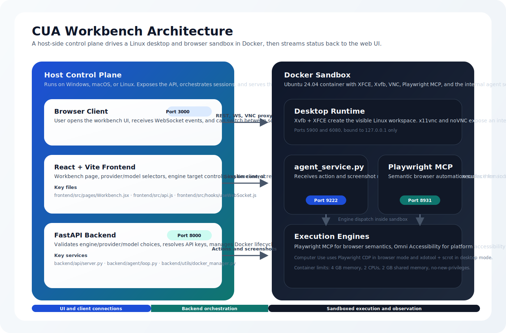
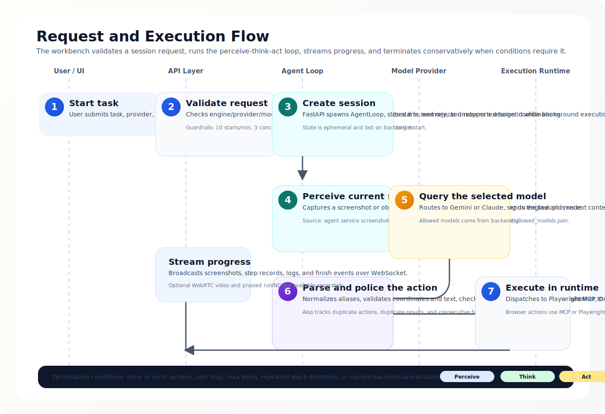
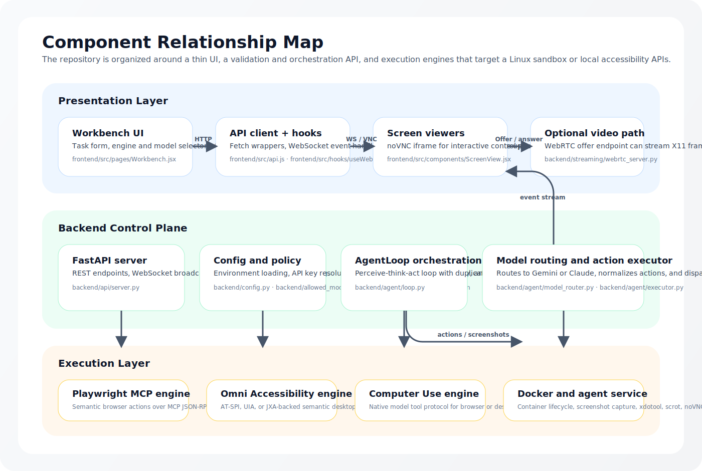
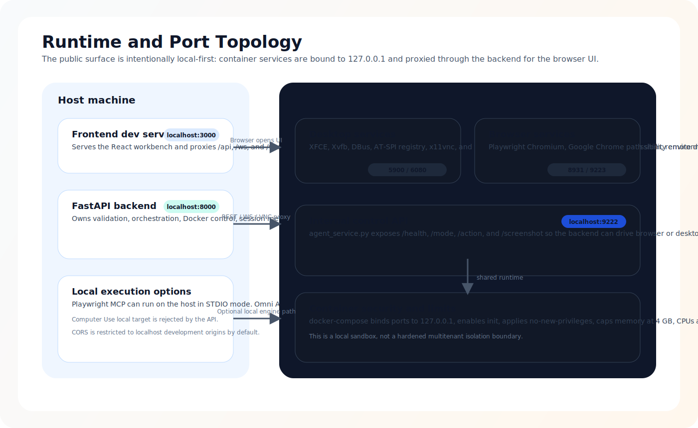

# CUA Workbench

<p align="center">
  
</p>

<p align="center">
  <a href="LICENSE"></a>
  
  
  
  
  
</p>

CUA Workbench is a local-first environment for building, testing, and observing computer-using agents. It combines a React workbench, a FastAPI orchestration backend, and a Dockerized Ubuntu desktop so you can run browser and desktop automation in a visible sandbox while streaming logs, screenshots, and session status back to the UI.

The repository supports three execution styles that are already wired into the codebase: semantic browser automation through Playwright MCP, accessibility-driven automation through platform accessibility APIs, and native Computer Use execution for allowlisted Gemini and Claude models.

## Why this repository exists

- Run agent tasks inside a visible Linux sandbox instead of blind headless automation.
- Compare browser-semantic, accessibility-semantic, and native computer-use execution paths from one UI.
- Keep model and engine choices explicit. The backend validates the requested engine, provider, and model instead of auto-switching behind the scenes.
- Observe every run through REST, WebSocket, screenshots, noVNC, and optional WebRTC streaming.

## At a glance

| Layer | Implementation | What it does |
| --- | --- | --- |
| Frontend | React 19 + Vite 6 | Workbench UI, engine/model selection, logs, screenshots, and noVNC embedding |
| Backend | FastAPI + Uvicorn | Validation, session orchestration, Docker lifecycle, WebSocket broadcast, and API surface |
| Sandbox | Ubuntu 24.04 container | XFCE desktop, Xvfb, x11vnc, noVNC, Playwright MCP, Chromium, and internal agent service |
| Models | Google Gemini and Anthropic Claude | Routed through a strict allowlist in `backend/allowed_models.json` |
| Engines | `playwright_mcp`, `omni_accessibility`, `computer_use` | Browser semantic control, accessibility semantic control, and native computer-use flow |

## Key features

- Three built-in automation engines with explicit per-session selection.
- Local React workbench with live screenshots, session logs, and step history.
- Linux desktop sandbox exposed through noVNC and optional WebRTC.
- Strict allowlists for engines and models at the API layer.
- API key resolution from UI input, `.env`, or system environment variables.
- In-memory session lifecycle with WebSocket broadcast for screenshots, logs, steps, and completion.
- Docker runtime with localhost-only published ports, `no-new-privileges`, and resource limits in `docker-compose.yml`.
- Extensive test coverage across engine routing, model policy, agent loop behavior, and stress scenarios.

## Architecture


The host machine runs the frontend and backend. The backend always starts the Docker sandbox before launching a session, then delegates action execution to the selected engine. The container hosts the visible Linux runtime, the internal `agent_service.py` HTTP API on port `9222`, and Playwright MCP on port `8931`.

### Core runtime surfaces

| Surface | Port | Notes |
| --- | --- | --- |
| Frontend dev server | `3000` | Vite dev server, proxies `/api`, `/ws`, and `/vnc` |
| Backend API | `8000` | FastAPI control plane |
| Agent service | `9222` | In-container HTTP API for actions, screenshots, mode switching, and health |
| Playwright MCP | `8931` | In-container MCP HTTP endpoint for browser-semantic actions |
| Chromium remote debugging | `9223` | Used by the browser-side Computer Use path |
| VNC / noVNC | `5900`, `6080` | Published on `127.0.0.1` only |

## Request and execution flow



When the UI calls `POST /api/agent/start`, the backend validates the request, resolves the API key, caps step count, and enforces concurrency limits. It then creates an `AgentLoop`, starts the Docker container if necessary, and begins the perceive-think-act cycle.

For `playwright_mcp` and `omni_accessibility`, the loop captures state, queries the selected provider, normalizes the resulting action, validates that action against the selected engine, executes it, and emits logs and step events. For `computer_use`, the loop delegates to the dedicated native Computer Use engine, which runs its own turn-based action cycle and can request explicit safety confirmation.

## Component map



The repository is organized around a thin UI, a strict API layer, and execution engines that stay isolated from one another. The engine router is intentionally simple: the user-selected engine is the engine used for the full session.

## Runtime topology



The published ports in `docker-compose.yml` are bound to `127.0.0.1`. The frontend does not talk to the container directly. Instead, it reaches noVNC and the WebSocket stream through backend proxy routes so the browser stays on the same origin during development.

## Supported engines

| Engine | Primary use | Execution target | Input style | Notes |
| --- | --- | --- | --- | --- |
| `playwright_mcp` | Semantic browser automation | `local` or `docker` | MCP tool calls and accessibility snapshot refs | Best fit for browser workflows where DOM and accessibility tree structure matter |
| `omni_accessibility` | Semantic desktop automation | `docker` for Linux AT-SPI, `local` for native host accessibility providers | Accessibility tree, roles, names, states, and semantic actions | Code includes Linux AT-SPI, Windows UIA, and macOS JXA providers |
| `computer_use` | Native model-controlled browser or desktop operation | `docker` only | Native Computer Use tool protocol | Backend rejects `execution_target=local` for this engine |

### Execution behavior by engine

| Capability | `playwright_mcp` | `omni_accessibility` | `computer_use` |
| --- | --- | --- | --- |
| Browser-semantic interaction | Yes | Limited to accessibility-exposed browser UI | No DOM semantics, pixel-oriented model tool flow |
| Desktop-semantic interaction | No | Yes | Yes, through browser or desktop executors |
| Model action format | MCP tool call or normalized action | Normalized action | Native model tool protocol |
| Screenshot-driven reasoning | Sometimes | Yes | Yes |
| Accessibility snapshot-driven reasoning | Yes | Yes | No |

## Supported providers and models

The backend reads the canonical allowlist from `backend/allowed_models.json`, and the frontend builds its dropdowns from `GET /api/models`.

| Provider | Model ID | Display name | Computer Use metadata |
| --- | --- | --- | --- |
| Google | `gemini-3-flash-preview` | Gemini 3 Flash Preview | Supports Computer Use |
| Google | `gemini-3.1-pro-preview` | Gemini 3.1 Pro Preview | Supports Computer Use |
| Anthropic | `claude-sonnet-4-6` | Claude Sonnet 4.6 | Uses `computer_20251124` with `computer-use-2025-11-24` beta |
| Anthropic | `claude-opus-4-6` | Claude Opus 4.6 | Uses `computer_20251124` with `computer-use-2025-11-24` beta |

## Quickstart

### Prerequisites

- Docker with a running daemon
- Python 3.10 or newer
- Node.js 18 or newer

### Option 1: repository setup script

Windows:

```bat
setup.bat
```

Linux or macOS:

```bash
bash setup.sh
```

Both scripts do the same core work:

- verify Docker, Python, and Node.js
- build the Docker image through `docker compose build`
- create a local virtual environment and install `requirements.txt`
- install frontend dependencies with `npm install`

### Option 2: manual setup

```bash
docker compose build

python -m venv .venv
# Windows: .venv\Scripts\activate
# Linux/macOS: source .venv/bin/activate
python -m pip install --upgrade pip
python -m pip install -r requirements.txt

cd frontend
npm install
cd ..
```

### Configure at least one provider key

You can provide keys in the UI, through a `.env` file in the repository root, or through system environment variables.

```env
GOOGLE_API_KEY=your-google-key
ANTHROPIC_API_KEY=your-anthropic-key
```

Key resolution order in the backend is:

1. key entered in the UI
2. key in `.env`
3. key in the system environment

### Run the stack

Start the container:

```bash
docker compose up -d --build
```

Start the backend:

```bash
python -m backend.main
```

Start the frontend:

```bash
cd frontend
npm run dev
```

Open `http://localhost:3000` and start a session from the workbench.

## Usage

### Typical workflow

1. Open the workbench at `http://localhost:3000`.
2. Choose run mode, provider, model, engine, target, and max steps.
3. Enter a task description.
4. Start the session and monitor screenshots, logs, and step records.
5. Switch to the interactive noVNC view when you need direct visibility into the sandbox.

### What the UI controls

| Control | Effect |
| --- | --- |
| Run mode | Switches between browser-oriented and desktop-oriented session defaults |
| Provider and model | Uses the backend allowlist exposed by `/api/models` |
| Engine | Selects one of the three supported engines without fallback substitution |
| Execution target | Uses local execution for supported engines or Docker execution inside the sandbox |
| API key source | Chooses manual UI input, `.env`, or system environment when available |

### Session behavior worth knowing

- The backend always starts the Docker container before launching a session.
- Session state is stored in memory only.
- WebSocket clients receive screenshots, logs, step events, and final session status.
- The loop injects recovery hints when it detects repeated actions or duplicate results.

## Configuration

The main runtime configuration lives in `backend/config.py` and is sourced from environment variables.

| Variable | Default | Purpose |
| --- | --- | --- |
| `HOST` | `0.0.0.0` | Backend bind address |
| `PORT` | `8000` | Backend port |
| `DEBUG` | `false` | Enables debug logging and hot reload mode |
| `CONTAINER_NAME` | `cua-environment` | Docker container name |
| `CONTAINER_IMAGE` | `cua-ubuntu:latest` | Docker image tag |
| `AGENT_SERVICE_HOST` | `127.0.0.1` | Agent service host from the backend perspective |
| `AGENT_SERVICE_PORT` | `9222` | Agent service port |
| `PLAYWRIGHT_MCP_HOST` | `localhost` | Playwright MCP host |
| `PLAYWRIGHT_MCP_PORT` | `8931` | Playwright MCP port |
| `PLAYWRIGHT_MCP_PATH` | `/mcp` | MCP HTTP endpoint path |
| `PLAYWRIGHT_MCP_AUTOSTART` | `false` | Enables MCP auto-start when configured |
| `SCREEN_WIDTH` | `1440` | Virtual screen width |
| `SCREEN_HEIGHT` | `900` | Virtual screen height |
| `MAX_STEPS` | `50` | Default session step budget |
| `STEP_TIMEOUT` | `30.0` | Per-step timeout in seconds |

### Optional extras

`requirements.txt` intentionally does not install WebRTC dependencies. If you want the `/webrtc/offer` path to work, install them separately:

```bash
python -m pip install aiortc av
```

## Backend and API overview

### Main REST endpoints

| Method | Path | Purpose |
| --- | --- | --- |
| `GET` | `/api/health` | Basic liveness check |
| `GET` | `/api/container/status` | Reports container state and agent service health |
| `POST` | `/api/container/start` | Starts the Docker sandbox |
| `POST` | `/api/container/stop` | Stops active sessions and removes the container |
| `POST` | `/api/container/build` | Builds the Docker image |
| `GET` | `/api/keys/status` | Shows provider key availability and source |
| `GET` | `/api/models` | Returns the allowlisted model list |
| `GET` | `/api/engines` | Returns available engines and frontend metadata |
| `GET` | `/api/screenshot` | Returns the current screenshot as base64 |
| `POST` | `/api/agent/start` | Starts a new session |
| `POST` | `/api/agent/stop/{session_id}` | Stops a running session |
| `GET` | `/api/agent/status/{session_id}` | Returns current session progress |
| `GET` | `/api/agent/history/{session_id}` | Returns step history without screenshots |
| `POST` | `/api/agent/safety-confirm` | Responds to Computer Use safety confirmation requests |
| `POST` | `/webrtc/offer` | Negotiates a WebRTC screen stream when optional packages are installed |

### WebSocket events

The frontend connects to `/ws` and receives JSON events with the following shapes:

| Event | Meaning |
| --- | --- |
| `screenshot` | Step-specific screenshot emitted during execution |
| `screenshot_stream` | Periodic desktop screenshot stream |
| `log` | Structured log entry |
| `step` | Step record without raw model response or image payload |
| `agent_finished` | Session completion summary |
| `pong` | Reply to frontend keepalive ping |

### VNC and live screen routes

| Route | Purpose |
| --- | --- |
| `/vnc/{path}` | Reverse proxy for noVNC static assets |
| `/vnc/websockify` | WebSocket proxy for the noVNC transport |

## Project structure

```text
.
├── backend/
│   ├── agent/                  # model routing, prompts, screenshot capture, execution loop
│   ├── api/                    # FastAPI server and endpoints
│   ├── engines/                # Computer Use and accessibility engines
│   ├── streaming/              # optional WebRTC/X11 video support
│   ├── tools/                  # action normalization, engine router, schema helpers
│   └── utils/                  # Docker lifecycle and utility helpers
├── docker/
│   ├── Dockerfile              # Ubuntu desktop image
│   ├── entrypoint.sh           # Xvfb, XFCE, AT-SPI, VNC, MCP, agent service boot
│   └── agent_service.py        # in-container browser and desktop execution API
├── frontend/
│   └── src/                    # React workbench UI, API client, hooks, and components
├── tests/                      # unit, policy, transport, loop, and stress tests
├── docs/assets/                # README diagrams
├── docker-compose.yml          # local runtime topology and limits
├── requirements.txt            # Python runtime dependencies
├── setup.bat                   # Windows setup script
└── setup.sh                    # Linux/macOS setup script
```

## Safety and runtime notes

- The Docker runtime is local-first. Ports are bound to `127.0.0.1` in `docker-compose.yml`.
- The container uses `no-new-privileges:true`, `init: true`, a 4 GB memory limit, a 2 CPU limit, and a 2 GB shared-memory allocation.
- This is a useful local sandbox, not a formal security boundary or multitenant isolation system.
- The backend keeps session state in memory. Restarting the backend clears active sessions and history.
- The Computer Use engine can surface `require_confirmation` decisions that must be resolved through `/api/agent/safety-confirm`.

## Development and testing

### Run the application in development

```bash
docker compose up -d --build
python -m backend.main

cd frontend
npm run dev
```

### Run tests

The repository includes pytest-based tests, but `pytest` is not pinned in `requirements.txt`, so install it explicitly in your dev environment first.

```bash
python -m pip install pytest
```

Run the main suite:

```bash
pytest tests -v --ignore=tests/stress
```

Run stress-oriented scenarios separately:

```bash
pytest tests/stress -v
```

There is also a standalone harness under `backend/tests/stress_system.py` for backend-driven stress execution.

## Troubleshooting

| Problem | What to check |
| --- | --- |
| Container does not start | Make sure Docker is running, then try `docker compose up -d --build` and inspect `docker compose ps` |
| UI shows no screenshots | Check that the container is running and that the backend can reach `http://127.0.0.1:9222/health` |
| Model start request is rejected | Verify the provider key is available and the selected model matches the allowlist from `/api/models` |
| Computer Use fails on local target | Switch the execution target to Docker; the backend rejects local Computer Use sessions by design |
| noVNC view is unavailable | Confirm the backend is up and the `/vnc` proxy can reach the container on port `6080` |
| WebRTC endpoint errors | Install `aiortc` and `av`, then restart the backend |
| Accessibility actions fail in Docker | Check that the container completed AT-SPI startup and that DBus, `at-spi2-registryd`, and XFCE initialized correctly |

## Limitations and near-term gaps

- Session persistence is not implemented. All runtime state is in memory.
- There is no CI configuration in this repository today, so verification is local and script-driven.
- WebRTC support is optional and requires extra packages.
- The browser-facing path is stronger than the desktop path for general-purpose web workflows because it has richer semantic tooling.
- The repository is optimized for local development and evaluation, not remote multitenant hosting.

## Contributing

Contributions should preserve the repository's current design principles:

- keep engine selection explicit rather than silently switching engines
- keep model exposure rooted in `backend/allowed_models.json`
- avoid broadening public claims beyond what the code implements today
- prefer documentation and tests when changing behavior that affects prompts, engine routing, or runtime setup

If you change runtime behavior, update the diagrams and README sections that describe the affected flow.

## License

This repository is licensed under the MIT License. See [LICENSE](LICENSE).