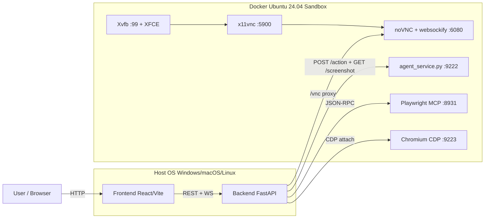
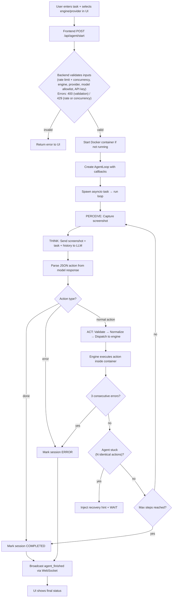
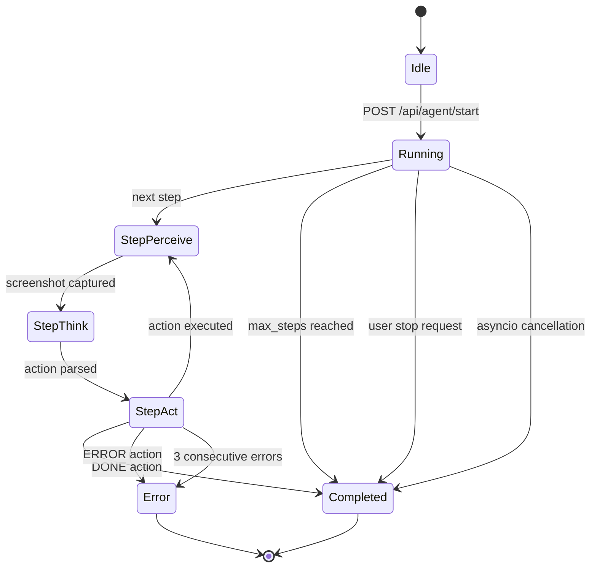
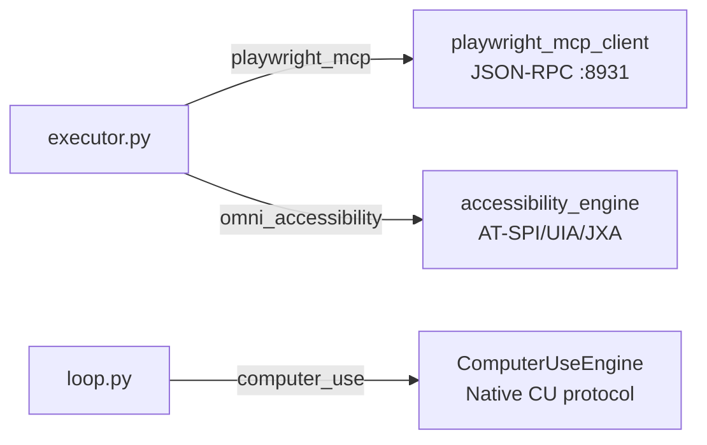

<div align="center">

# 🖥️ CUA Workbench

### Computer-Using Agent Workbench

[](https://python.org)
[](https://fastapi.tiangolo.com)
[](https://react.dev)
[](https://docker.com)
[](https://playwright.dev)
[](LICENSE)

[](#testing)
[](#)

A cross-platform workbench for building and testing **computer-using agents**.  
Run a full **Linux desktop + browser inside Docker**, stream it live in a **web UI**,  
and drive it using **native Computer Use protocols** (Gemini / Claude) or **Playwright MCP**.

[Getting Started](#quickstart-tldr) • [Architecture](#architecture-overview) • [API Docs](#api-surface) • [Contributing](#contributing)

</div>

---

### ✨ Highlights

- 💻 **Windows/macOS/Linux hosts** — backend + UI run on host
- 🔒 **Safe execution in a Docker sandbox** — desktop/browser automation happens inside the container
- 🤖 **Provider-native computer use** — Gemini CU + Claude CU
- 🧩 **Tooling-first automation** — Playwright MCP + accessibility engine

### 🛠️ Built With

| Backend | Frontend | Infrastructure | AI Providers |
|:---:|:---:|:---:|:---:|
|  |  |  |  |
|  |  |  |  |
|  |  |  |  |

---

## 📑 Table of Contents

| | | |
|---|---|---|
| 1. [🔭 Project Overview](#project-overview) | 9. [⚙️ Engine Breakdown](#engine-breakdown) | 17. [🧪 Testing](#testing) |
| 2. [🚀 Quickstart (TL;DR)](#quickstart-tldr) | 10. [🔐 Security Model](#security-model) | 18. [🔧 Troubleshooting](#troubleshooting) |
| 3. [🤖 Model Policy](#model-policy-ui--api) | 11. [🧠 LLM Provider Integration](#llm-provider-integration) | 19. [⚠️ Limitations](#limitations) |
| 4. [🏗️ Architecture Overview](#architecture-overview) | 12. [📡 API Surface](#api-surface) | 20. [🔮 Future Improvements](#future-improvements) |
| 5. [🔄 System Flow](#system-flow) | 13. [🐳 Docker Runtime](#docker-runtime) | 21. [🤝 Contributing](#contributing) |
| 6. [📊 Agent Loop Logic](#agent-loop-logic) | 14. [📝 Configuration](#configuration) | 22. [🛡️ Security Reporting](#security-reporting) |
| 7. [💾 Data Model & State](#data-model--state) | 15. [📦 Setup & Installation](#setup--installation) | 23. [📄 License](#license) |
| 8. [🧩 Core Modules](#core-modules) | 16. [▶️ Running the Application](#running-the-application) | |

---

## 🔭 Project Overview

CUA implements a **perceive → think → act** loop: it captures a screenshot of a virtual Linux desktop, sends the image to a vision-language model alongside the user's task description, receives a structured action command, and executes that command on the desktop. This cycle repeats until the task is complete, an error is unrecoverable, or the step limit is reached.

### Key Capabilities

| | Capability | Implementation |
|:---:|---|---|
| 🌐 | Browser automation (accessibility-tree) | Playwright MCP server via JSON-RPC |
| ♿ | Semantic desktop automation | AT-SPI2 accessibility framework via GObject Introspection |
| 🤖 | Native computer-use protocol | Gemini CU + Claude CU structured tool calls (model-driven action loop) |
| 📹 | Real-time screen streaming | WebSocket screenshots, WebRTC via ffmpeg x11grab + aiortc, noVNC |
| 🧠 | Multi-provider AI (model allowlist) | UI is restricted to 4 models (served by `GET /api/models`): `claude-sonnet-4-6`, `claude-opus-4-6`, `gemini-3-flash-preview`, `gemini-3.1-pro-preview` |

### Problem It Solves

CUA enables natural-language-driven computer control — a user describes a task in plain text (e.g., "Open Firefox and search for weather in New York"), and the agent autonomously operates the desktop to complete it, reporting progress in real time through a web UI.

---

## 🚀 Quickstart (TL;DR)

> Runs on Windows/macOS/Linux (host) and executes desktop/browser actions inside a Docker Linux sandbox.

<table>
<tr><td>

**① Start the Docker sandbox**
```bash
docker compose up --build -d
```
Sanity check: `curl http://127.0.0.1:9222/health`

</td><td>

**② Start the backend**
```bash
python -m backend.main
```

</td></tr>
<tr><td>

**③ Start the frontend**
```bash
cd frontend && npm install && npm run dev
```

</td><td>

**④ Open the Workbench**
- 🌐 UI: [http://127.0.0.1:3000](http://127.0.0.1:3000)
- 📺 noVNC: [http://127.0.0.1:6080](http://127.0.0.1:6080)

</td></tr>
</table>

**⑤ Run a first task** — Desktop: *"open file explorer"*  ·  Browser: *"go to example.com"*

> 💡 **Windows note:** Prefer `127.0.0.1` over `localhost` to avoid IPv6 binding issues with Docker.

---

## 🤖 Model Policy (UI + API)

The UI dropdown is intentionally restricted to **four** models:

- **Anthropic**: `claude-sonnet-4-6`
- **Anthropic**: `claude-opus-4-6`
- **Google**: `gemini-3-flash-preview`
- **Google**: `gemini-3.1-pro-preview`

**Single source of truth:** `backend/allowed_models.json`  
**Frontend source:** `GET /api/models`  
**Backend enforcement:** `POST /api/agent/start` rejects any provider/model not in the allowlist.

### Add more models later (extensible by design)
1. Edit `backend/allowed_models.json`
2. Restart the backend
3. The UI auto-refreshes supported models from `GET /api/models`

> Tip: keep the allowlist small by default. It makes demos reliable and avoids "model drift" across machines.

---

## 🏗️ Architecture Overview

The system is a **three-process architecture** running across the host and a Docker container:

| Layer | Technology | Entry Point | Port |
|---|---|---|---|
| **Backend** | Python 3 / FastAPI / Uvicorn | `backend/main.py` → `backend.api.server:app` | 8000 |
| **Frontend** | React / Vite / React Router (see [`frontend/package.json`](frontend/package.json)) | `frontend/src/main.jsx` | 3000 |
| **Container** | Ubuntu 24.04 / XFCE 4 / Xvfb / Playwright | `docker/entrypoint.sh` → `docker/agent_service.py` | 9222 |

### Component Map

```
backend/
  main.py                – Uvicorn launcher
  config.py              – Config dataclass, from_env(), API key resolution
  models.py              – ActionType enum (100+ actions), Pydantic models
  agent/
    loop.py              – AgentLoop: perceive → think → act orchestrator
    executor.py          – Action dispatch: validate → normalize → route to engine
    model_router.py      – Provider dispatch: Google Gemini or Anthropic Claude
    gemini_client.py     – Gemini API: multi-turn, 15-action history, retries
    anthropic_client.py  – Claude API: same interface as gemini_client
    prompts.py           – 3 engine-specific system prompts
    screenshot.py        – Screenshot capture via agent service + docker exec fallback
    playwright_mcp_client.py – MCP JSON-RPC client, subprocess management
  api/
    server.py            – FastAPI: REST + WebSocket + WebRTC + noVNC proxy
  engines/
    accessibility_engine.py – AT-SPI tree walker, element cache, input fallback
    computer_use_engine.py – Native Computer Use protocol (Gemini/Claude CU)
  streaming/
    video_capture.py     – ffmpeg x11grab → av.VideoFrame async generator
    webrtc_server.py     – aiortc peer connections (max 2 concurrent)
  tools/
    router.py            – SUPPORTED_ENGINES set, validate_engine()
    action_aliases.py    – ~100 action aliases + per-engine capability matrix
    unified_schema.py    – UnifiedAction model, normalize_action()
  health/
    engine_certifier.py  – Runtime engine certification against capabilities schema
  utils/
    docker_manager.py    – Container lifecycle via docker CLI subprocess
    parity_check.py      – tools_list.txt ↔ ActionType ↔ MCP handler audit

docker/
  Dockerfile             – Ubuntu 24.04, XFCE 4, Chrome, Firefox, Playwright, AT-SPI
  entrypoint.sh          – Xvfb + XFCE + x11vnc + noVNC + ydotoold + agent service
  agent_service.py       – Synchronous HTTP server: browser / desktop / ydotool dispatch

frontend/
  src/App.jsx            – Dashboard: Header + ControlPanel + ScreenView + LogPanel
  src/pages/Workbench.jsx – Workbench UI: browser/desktop mode, timeline, log viewer
  src/api.js             – REST client for all /api/* endpoints
  src/hooks/useWebSocket.js – WebSocket client: screenshot, log, step events; auto-reconnect
  src/components/        – ControlPanel, Header, ScreenView, LogPanel
```

### Communication Protocols

| Path | Protocol | Source → Target |
|---|---|---|
| Frontend → Backend (REST) | HTTP | `api.js` → `server.py` endpoints |
| Frontend → Backend (live events) | WebSocket | `useWebSocket.js` → `/ws` in `server.py` |
| Frontend → Backend (video) | WebRTC | `ScreenView.jsx` → `/webrtc/offer` → `webrtc_server.py` |
| Frontend → Container (VNC) | noVNC (WebSocket) | `ScreenView.jsx` `/vnc/websockify` proxy in `server.py` |
| Backend → Agent Service | HTTP POST | `executor.py` → `:9222/action` |
| Backend → Agent Service (screenshot) | HTTP GET | `screenshot.py` → `:9222/screenshot` |
| Backend → Docker CLI | Subprocess | `docker_manager.py` → `docker build/run/rm/exec` |

### Deployment Diagram



---

## 🔄 System Flow

### End-to-End Execution: User Input → Final Output



### Step-by-Step Breakdown

1. **User submits task** via the Workbench UI (`Workbench.jsx`), selecting provider (Google/Anthropic), model, engine, and entering the task description.
2. **Frontend calls** `POST /api/agent/start` with `StartTaskRequest` payload (`api.js`).
3. **Backend validates** rate limit (10 starts/min), engine membership in `SUPPORTED_ENGINES`, provider/model allowlists, API key resolution (UI → .env → system env), max concurrent sessions (≤3), and task non-emptiness (`server.py`).
4. **Docker container starts** automatically via `docker_manager.start_container()` if not already running.
5. **`AgentLoop`** is instantiated with callbacks for log, step, and screenshot events that broadcast to all WebSocket clients (`server.py`).
6. **Pre-flight checks** run per engine: agent service health for all, MCP initialization for `playwright_mcp`, AT-SPI bus check for `omni_accessibility` (`loop.py`).
7. **Perceive**: `capture_screenshot()` calls the agent service (`GET :9222/screenshot?mode={mode}`) or falls back to `docker exec scrot` (`screenshot.py`).
8. **Think**: `query_model()` routes to `query_gemini()` or `query_claude()` with the screenshot, task, step number, last 15 actions as history, and the engine-specific system prompt (`model_router.py`).
9. **Parse**: The raw model text is stripped of markdown fences, JSON is extracted (handling nested braces), action aliases are resolved, and an `AgentAction` is validated (`gemini_client.py` / `anthropic_client.py`).
10. **Act**: `execute_action()` validates the engine, normalizes the action via `UnifiedAction`, checks engine capability schema, validates coordinates (≤1440×900) and text (≤5000 chars), then dispatches to the correct engine (`executor.py`).
11. **Termination**: The loop ends on `DONE` action, `ERROR` action, 3 consecutive step errors, user stop request, cancellation, or reaching `max_steps`.
12. **Real-time updates**: Each step, log entry, and screenshot is broadcast to WebSocket clients. The UI renders a live timeline, log viewer, and screen view.

---

## 📊 Agent Loop Logic

### Core Loop (`backend/agent/loop.py`)

`AgentLoop.run()` executes up to `max_steps` iterations. Each step runs through `_execute_step()` with a per-step timeout (`step_timeout`, default 30s).

### Failure Recovery

- **Consecutive error tracking**: A counter resets on each successful step and increments on errors. At 3 consecutive errors (`MAX_CONSECUTIVE_ERRORS`), the session aborts with `ERROR` status.
- **Duplicate action detection**: `_detect_stuck()` checks whether the last N actions have the same action type, similar coordinates, and same text. If stuck, a `WAIT` action with a recovery hint is injected. Parameters are engine-aware:
  - **Browser** (`playwright_mcp`): lookback = 3 actions, coordinate tolerance = 10 px (`MAX_DUPLICATE_ACTIONS`, `loop.py:L704`)
  - **Desktop** (`omni_accessibility` / `computer_use`): lookback = 2 actions, coordinate tolerance = 30 px (`MAX_DUPLICATE_ACTIONS_DESKTOP`, `DESKTOP_COORD_TOLERANCE`, `loop.py:L43-44`)
  - **Maximum stuck detections**: After 3 stuck-detection firings (`MAX_STUCK_DETECTIONS`), the loop force-terminates to prevent burning steps on ignored recovery hints.
  - **Duplicate result detection**: If the last 2+ execution results are identical (e.g., same `evaluate_js` output), an ultimatum to return `done`/`error` is injected (`MAX_DUPLICATE_RESULTS = 2`).
- **Recovery hints** (`_build_recovery_hint()`): Engine-specific remediation advice is injected as the reasoning for the WAIT action. For example, a stuck `CLICK` triggers advice to use `evaluate_js`, `key Enter`, or `scroll_to`. A stuck `FILL` suggests discovering field names via JS evaluation.

### State Machine



---

## 💾 Data Model & State

### `AgentSession` (Pydantic model, `backend/models.py`)

| Field | Type | Purpose |
|---|---|---|
| `session_id` | `str` (UUID) | Unique session identifier |
| `task` | `str` | User's task description |
| `status` | `SessionStatus` enum | `idle` / `running` / `paused` / `completed` / `error` |
| `model` | `str` | Model identifier (e.g., `gemini-3-flash-preview`) |
| `engine` | `str` | Automation engine (e.g., `playwright_mcp`) |
| `steps` | `list[StepRecord]` | Ordered list of executed steps |
| `max_steps` | `int` | Step limit for this session (1–200) |
| `created_at` | `str` (ISO 8601) | Session creation timestamp |

### `StepRecord` (Pydantic model)

| Field | Type | Purpose |
|---|---|---|
| `step_number` | `int` | 1-based step index |
| `timestamp` | `str` (ISO 8601) | Step execution time |
| `screenshot_b64` | `str` or `None` | Base64-encoded PNG screenshot |
| `action` | `AgentAction` or `None` | The action chosen by the model |
| `raw_model_response` | `str` or `None` | Raw LLM output text |
| `error` | `str` or `None` | Error message if the step failed |

### `AgentAction` (Pydantic model)

| Field | Type | Purpose |
|---|---|---|
| `action` | `ActionType` enum | One of 100+ action types |
| `target` | `str` or `None` | CSS selector, element name, or description |
| `coordinates` | `list[int]` or `None` | `[x, y]` or `[x1, y1, x2, y2]` (max 4 values) |
| `text` | `str` or `None` | Input text, URL, key name, or JS code |
| `reasoning` | `str` or `None` | Model's explanation of why it chose this action |

### `StartTaskRequest` (API input)

| Field | Type | Constraints |
|---|---|---|
| `task` | `str` | Required, max 10,000 chars |
| `api_key` | `str` or `None` | Optional (resolved from env if empty), max 256 chars |
| `model` | `str` | Max 64 chars |
| `max_steps` | `int` | 1–200, default 50, hard-capped at 200 |
| `mode` | `str` | `browser` or `desktop` |
| `engine` | `str` | Required (no default) — one of the 3 supported engines |
| `provider` | `str` | `google` or `anthropic` |
| `system_prompt` | `str` or `None` | Optional custom system prompt, max 50,000 chars |
| `allowed_domains` | `list[str]` or `None` | Optional domain allowlist, max 50 entries |

### In-Memory State (`backend/api/server.py`)

```python
_active_loops: dict[str, AgentLoop] = {}   # session_id → AgentLoop instance
_active_tasks: dict[str, asyncio.Task] = {} # session_id → asyncio.Task
_ws_clients: list[WebSocket] = []           # connected WebSocket clients
```

No persistent database is used. All session state lives in memory and is lost on backend restart.

---

## 🧩 Core Modules

### `execute_action()` — Action Executor (`backend/agent/executor.py`)

| | |
|---|---|
| **Purpose** | Validate, normalize, and dispatch a single action to the selected engine |
| **Input** | `AgentAction` or `dict`, `mode` (browser/desktop), `engine` name |
| **Output** | `dict` with `success: bool`, `message: str`, `error_type: str or None` |
| **Behavior** | 1. Validates engine via `router.validate_engine()`. 2. Normalizes via `unified_schema.normalize_action()`. 3. Checks action against `engine_capabilities.json`. 4. Validates coordinates (non-negative, ≤1440×900) and text (≤5000 chars). 5. Dispatches to the correct engine handler. 6. Applies post-action delay (`action_delay_ms`). |

### `query_model()` — Model Router (`backend/agent/model_router.py`)

| | |
|---|---|
| **Purpose** | Route LLM queries to the correct provider |
| **Input** | Provider name, API key, model name, task, screenshot, action history, step number, mode, system prompt |
| **Output** | `(AgentAction, raw_response_text)` tuple |
| **Behavior** | If `provider == "anthropic"`, calls `query_claude()`. Otherwise calls `query_gemini()`. |

### `capture_screenshot()` — Screenshot Capture (`backend/agent/screenshot.py`)

| | |
|---|---|
| **Purpose** | Capture the current screen as a base64 PNG |
| **Input** | `mode` (browser/desktop), optional `engine` |
| **Output** | Base64-encoded PNG string |
| **Behavior** | For `playwright_mcp` engine, captures from the MCP browser. For all others, calls `GET :9222/screenshot?mode={mode}`. Falls back to `docker exec scrot` on connection failure. |

### `normalize_action()` — Action Normalization (`backend/tools/unified_schema.py`)

| | |
|---|---|
| **Purpose** | Convert raw actions into a canonical `UnifiedAction` schema |
| **Input** | `AgentAction` or `dict`, engine name |
| **Output** | `UnifiedAction` Pydantic model |
| **Behavior** | Resolves action aliases, normalizes target/selector fields per engine, enforces coordinate types as integers, caps text at 5000 chars. |

### `resolve_action()` — Alias Resolution (`backend/tools/action_aliases.py`)

| | |
|---|---|
| **Purpose** | Map ~100 action aliases to canonical `ActionType` values |
| **Input** | Action string (e.g., `"press"`, `"navigate"`, `"dblclick"`) |
| **Output** | Canonical action string (e.g., `"key"`, `"open_url"`, `"double_click"`) |

### `validate_tool_parity()` — Parity Check (`backend/utils/parity_check.py`)

| | |
|---|---|
| **Purpose** | Audit alignment between `tools_list.txt`, `ActionType` enum, MCP handlers, and engine capabilities schema |
| **Behavior** | Runs at backend startup. Logs warnings for mismatches and errors for missing MCP handlers. |

---

## ⚙️ Engine Breakdown

Three engines are defined in `SUPPORTED_ENGINES` (sourced from `engine_capabilities.json`):

### 1. `playwright_mcp` — Browser Automation (Accessibility-Tree-Based)

- **Dispatch**: `executor.py` → `playwright_mcp_client.execute_mcp_action()` → JSON-RPC over HTTP to the Playwright MCP server on port 8931
- **Runtime**: Standalone MCP server (`@playwright/mcp`) managing its own browser instance
- **Actions**: click, fill, type, navigate, tabs (by accessible name/role, not coordinates)
- **System prompt**: `SYSTEM_PROMPT_PLAYWRIGHT_MCP` — targets elements by name/role/label
- **Special**: Uses `find_element` to get accessibility snapshots; coordinates are ignored

### 2. `omni_accessibility` — Cross-Platform Semantic Desktop Automation

- **Dispatch**: `executor.py` → `accessibility_engine.execute_accessibility_action()` → AT-SPI2 (Linux) / UI Automation (Windows) / JXA (macOS) + xdotool for physical input
- **Runtime**: Platform auto-detected — GObject Introspection (Linux), PowerShell UIA (Windows), osascript JXA (macOS)
- **Actions**: find elements by role/name/state, click by element ID, type into focused elements, get accessibility tree, navigate tree nodes, window activation
- **Features**: TTL element cache, circuit breaker, semantic scoring, post-action verification, cross-platform provider abstraction
- **Requirements**: Linux: `at-spi2-core`, `python3-gi`, D-Bus | Windows: PowerShell 5.1+ | macOS: Accessibility permissions

### 3. `computer_use` — Native Computer-Use Protocol (Gemini CU / Claude CU)

- **Dispatch**: `loop.py` → `_run_computer_use_engine()` → `ComputerUseEngine.execute_task()` (bypasses `executor.py` entirely — the model controls the action loop)
- **Runtime**: Uses provider-native computer-use tools.
  - **Gemini**: `computer_use` tool with screenshot/action loop (normalized coordinates).
  - **Claude**: tool version is **auto-detected** (e.g., `computer_20250124` vs `computer_20251124` depending on model), using `client.beta.messages.create(..., betas=[...])`. `ClaudeCUClient` also accepts explicit `tool_version`/`beta_flag` params from `allowed_models.json` metadata.
- **Execution modes**: Browser (via Playwright CDP page) or Desktop (via xdotool + scrot)
- **Coordinate handling**: Gemini sends normalized 0–999 coordinates (denormalized to pixels by the executor); Claude sends real pixel coordinates
- **Actions**: `click_at`, `double_click_at`, `type_text_at`, `key_combination`, `scroll_at`, `move_mouse`, `drag_to`, `wait`, `screenshot`, `navigate_to`, `go_back`, `go_forward`, `select_option`, `hover_at`, `done`
- **Features**: Model-driven screenshot loop, safety decision handling (`require_confirmation`), inline base64 screenshot feedback, thinking/reasoning traces
- **Contract**: Uses its own internal turn loop — never dispatched through `execute_action()`

### Engine Dispatch Diagram



### Engine Isolation

The executor enforces **strict engine isolation**: the user-chosen engine is used for every action in the session. No fallback to other engines occurs at the executor level. The `computer_use` engine bypasses the executor entirely — it runs its own model-driven loop via `ComputerUseEngine`. This is verified by 15 tests in `tests/test_engine_isolation.py`.

---

## 🔐 Security Model

### Input Validation (`backend/api/server.py`, `backend/agent/executor.py`)

| Protection | Implementation |
|---|---|
| **Rate limiting** | Sliding-window limiter: max 10 `POST /api/agent/start` calls per 60 seconds (`_RateLimiter` class) |
| **Concurrent session cap** | Max 3 active sessions (`_MAX_CONCURRENT_SESSIONS`) |
| **Max steps hard cap** | `max_steps` capped at 200 regardless of user input (`_MAX_STEPS_HARD_CAP`) |
| **Engine allowlist** | Request engine validated against `SUPPORTED_ENGINES` set |
| **Provider allowlist** | Only `google` and `anthropic` accepted (`_VALID_PROVIDERS`) |
| **Model allowlist** | Per-provider model validation (`_VALID_MODELS_BY_PROVIDER`) |
| **Session ID validation** | UUID format validation before any session lookup (`_is_valid_uuid()`) |
| **Task length limit** | Max 10,000 characters (`StartTaskRequest.task` field) |
| **API key masking** | Keys are masked in audit logs (`sk-a...9f2e` format) |
| **Coordinate bounds** | Validated ≤1440×900, non-negative integers |
| **Text length limit** | Max 5,000 characters per action |

### Container Security (`docker/agent_service.py`)

| Protection | Implementation |
|---|---|
| **Request body size** | Max 1 MB per request (`_MAX_BODY_SIZE`) |
| **Blocked shell commands** | Pattern list: `rm -rf /`, `mkfs.`, `dd if=/dev/`, `shutdown`, `reboot`, etc. (`_BLOCKED_CMD_PATTERNS`) |
| **Command allowlist** | Only specific commands permitted in `run_command` action: `ls`, `cat`, `grep`, `python3`, `curl`, etc. (`_ALLOWED_COMMANDS` frozenset) |
| **File upload path restriction** | Only `/tmp`, `/app`, `/home` directories allowed (`_UPLOAD_ALLOWED_PREFIXES`) |

### Container Isolation (`docker-compose.yml`)

| Setting | Value |
|---|---|
| `security_opt` | `no-new-privileges:true` |
| `shm_size` | `2gb` |
| Memory limit | `4g` |
| CPU limit | `2` cores |
| Port binding | `127.0.0.1` only (not exposed externally) |

### CORS (`backend/api/server.py`)

Restricted to local development origins: `localhost:5173`, `127.0.0.1:5173`, `localhost:3000`, `127.0.0.1:3000`. Methods limited to `GET` and `POST`.

### What the Security Model Does NOT Cover

- No authentication or authorization on the API (any local client can start agents)
- No TLS on inter-service HTTP (backend → agent service is plain HTTP over localhost)
- The `evaluate_js` action executes arbitrary JavaScript inside the browser with no sandboxing beyond the browser's own security context
- The `run_command` allowlist does not prevent all possible abuse (e.g., `python3 -c "..."` can run arbitrary code)
- WebSocket connections have no authentication

---

## 🧠 LLM Provider Integration

### Supported Providers & Models (UI Allowlist)

| Provider | Models in UI (allowlist) | Env Variable |
|---|---|---|
| Google Gemini | `gemini-3-flash-preview`, `gemini-3.1-pro-preview` | `GOOGLE_API_KEY` |
| Anthropic Claude | `claude-sonnet-4-6`, `claude-opus-4-6` | `ANTHROPIC_API_KEY` |

The UI options come from `GET /api/models` (loaded from `backend/allowed_models.json`).

### Model Selection

The user selects a provider and model in the UI. `model_router.query_model()` dispatches to the matching client. There is no automatic fallback between providers — if the selected provider fails, the step records an error.

### Request Construction

Both clients follow the same pattern:
1. Build a context window with the last 15 actions as history (trimmed for token economy)
2. Attach the current screenshot as an inline image (base64 PNG)
3. Include the task description and current step number
4. Set the engine-specific system prompt from `prompts.py`

### Response Parsing

Both clients use the same parsing logic:
1. Strip markdown fences (` ```json ... ``` `)
2. Extract the first valid JSON object (handling nested braces)
3. Resolve action aliases via `resolve_action()`
4. Validate that the action exists in `ActionType`
5. Return `(AgentAction, raw_response_text)`

### Retry Logic

The Gemini client retries up to `gemini_retry_attempts` (default 3) with `gemini_retry_delay` (default 2s) between attempts on transient failures. The Anthropic client follows the same pattern.

### API Key Resolution (`backend/config.py`)

Keys are resolved in priority order:
1. **UI input** — user pastes key in the Workbench
2. **`.env` file** — `GOOGLE_API_KEY` or `ANTHROPIC_API_KEY` in project root `.env`
3. **System environment** — same variable names as system env vars

The `/api/keys/status` endpoint reports which sources are available for each provider, including masked key previews.

---

## 📡 API Surface

### REST Endpoints (`backend/api/server.py`)

| Method | Path | Purpose |
|---|---|---|
| `GET` | `/api/health` | Liveness probe |
| `GET` | `/api/container/status` | Docker container + agent service health |
| `POST` | `/api/container/start` | Build-if-needed and start the container |
| `POST` | `/api/container/stop` | Stop all agents then remove container |
| `POST` | `/api/container/build` | Trigger Docker image build |
| `GET` | `/api/agent-service/health` | Check if agent service is responding |
| `POST` | `/api/agent-service/mode` | Switch agent service mode (browser/desktop) |
| `GET` | `/api/keys/status` | API key availability per provider |
| `GET` | `/api/models` | Canonical model allowlist for UI dropdowns |
| `GET` | `/api/engines` | Available engines for UI dropdowns |
| `GET` | `/api/screenshot` | Current screenshot as base64 |
| `POST` | `/api/agent/start` | Start a new agent session |
| `POST` | `/api/agent/stop/{session_id}` | Stop a running session |
| `GET` | `/api/agent/status/{session_id}` | Session status + last action |
| `GET` | `/api/agent/history/{session_id}` | Full step history (without screenshots) |
| `POST` | `/api/agent/safety-confirm` | Respond to CU engine safety confirmation prompt |
| `POST` | `/webrtc/offer` | WebRTC SDP offer/answer negotiation |
| `GET` | `/vnc/{path}` | noVNC static file proxy |
| `WS` | `/vnc/websockify` | noVNC WebSocket proxy to container websockify |

### WebSocket (`/ws`)

Events broadcast to all connected clients:

| Event | Payload | Trigger |
|---|---|---|
| `screenshot` | `{ screenshot: base64 }` | Each agent step screenshot capture |
| `screenshot_stream` | `{ screenshot: base64 }` | Periodic desktop screenshot (interval: `ws_screenshot_interval`) |
| `log` | `{ log: LogEntry }` | Agent log emission |
| `step` | `{ step: StepRecord }` (without screenshot/raw_response) | Each agent step completion |
| `agent_finished` | `{ session_id, status, steps }` | Agent loop termination |
| `pong` | `{}` | Response to client `ping` |

Client → Server: `{ type: "ping" }` for keepalive (sent every 15s by `useWebSocket.js`).

---

## 🐳 Docker Runtime

### Container: `cua-environment`

Built from `docker/Dockerfile` on Ubuntu 24.04. The entrypoint (`docker/entrypoint.sh`) starts the following services in order:

1. **D-Bus** — system + session bus (required for AT-SPI)
2. **Xvfb** — virtual X11 framebuffer at `:99`, resolution `1440×900×24`
3. **AT-SPI** — accessibility bridge + registry daemon (before desktop so apps register correctly)
4. **XFCE 4** — full desktop environment with window manager
5. **x11vnc** — VNC server on port 5900 (optional `VNC_PASSWORD` for authentication)
6. **noVNC + websockify** — browser-accessible VNC on port 6080
7. **Browser bootstrap** — pre-warms Chrome profile, sets default browser via `xdg-settings`
8. **ydotoold** — ydotool daemon (if `/dev/uinput` is available)
9. **Playwright MCP server** — `@playwright/mcp` HTTP transport on port 8931 (headless, `--no-sandbox`)
10. **Agent Service** — `agent_service.py` HTTP server on port 9222

### Pre-installed Software

- Google Chrome (stable), Firefox
- Playwright Chromium + Firefox browsers
- Playwright MCP server (`@playwright/mcp` via npm)
- xdotool, wmctrl, xclip, ydotool, scrot
- AT-SPI2 accessibility stack (`at-spi2-core`, `gir1.2-atspi-2.0`, `python3-gi`)
- ffmpeg (for video capture)
- Node.js 20 LTS

### Agent Service (`docker/agent_service.py`)

A synchronous `BaseHTTPRequestHandler` HTTP server (~2800 lines) running inside the container. Handles:

| Endpoint | Method | Purpose |
|---|---|---|
| `/health` | GET | Liveness check |
| `/screenshot` | GET | Capture via Playwright or scrot (query param `mode`) |
| `/action` | POST | Execute a single action (dispatches to browser/desktop/ydotool handler) |
| `/mode` | POST | Switch default mode at runtime |

### Port Map

| Port | Service | Binding |
|---|---|---|
| 5900 | VNC (x11vnc) | `127.0.0.1:5900` |
| 6080 | noVNC (websockify) | `127.0.0.1:6080` |
| 8931 | Playwright MCP server | `127.0.0.1:8931` |
| 9222 | Agent Service API | `127.0.0.1:9222` |
| 9223 | Chromium CDP (browser attach) | `127.0.0.1:9223` |

---

## 📝 Configuration

### Environment Variables (`backend/config.py`)

The table below lists all user-facing settings from `backend/config.py`. The first two rows are **API keys** resolved via `resolve_api_key()` (not `Config` dataclass fields, but still read from env / `.env`). The remaining rows are `Config` fields — only the **env-configurable** ones are read at startup via `Config.from_env()`. Compile-time defaults must be changed by editing `config.py` directly.

| Variable | Default | Env? | Description |
|---|---|---|---|
| `GOOGLE_API_KEY` | — | ✅ | Google Gemini API key (resolved by `resolve_api_key()`, not a `Config` field) |
| `ANTHROPIC_API_KEY` | — | ✅ | Anthropic Claude API key (resolved by `resolve_api_key()`, not a `Config` field) |
| `GEMINI_MODEL` | `gemini-3-flash-preview` | ✅ | Default Gemini model name |
| `CONTAINER_NAME` | `cua-environment` | ✅ | Docker container name |
| `CONTAINER_IMAGE` | `cua-ubuntu:latest` | — | Docker image tag — not in `from_env()` |
| `AGENT_SERVICE_HOST` | `127.0.0.1` | ✅ | Agent service hostname (use IPv4 — see note below) |
| `AGENT_SERVICE_PORT` | `9222` | ✅ | Agent service port |
| `AGENT_MODE` | `browser` | ✅ | Default agent mode |
| `PLAYWRIGHT_MCP_HOST` | `127.0.0.1` | ✅ | MCP server hostname (use IPv4 — see note below) |
| `PLAYWRIGHT_MCP_PORT` | `8931` | ✅ | MCP server port |
| `PLAYWRIGHT_MCP_PATH` | `/mcp` | ✅ | MCP JSON-RPC endpoint path |
| `PLAYWRIGHT_MCP_AUTOSTART` | `0` | ✅ | Auto-launch MCP subprocess (`0`/`1`) |
| `PLAYWRIGHT_MCP_COMMAND` | `npx` | ✅ | Executable that starts the MCP server |
| `PLAYWRIGHT_MCP_ARGS` | `-y @playwright/mcp@latest` | ✅ | Arguments passed to the MCP command |
| `SCREEN_WIDTH` | `1440` | ✅ | Virtual display width (pixels) |
| `SCREEN_HEIGHT` | `900` | ✅ | Virtual display height (pixels) |
| `SCREENSHOT_FORMAT` | `png` | — | Screenshot image format — not in `from_env()` |
| `SCREENSHOT_INTERVAL_SEC` | `1.0` | — | Video capture interval (seconds) — not in `from_env()` |
| `MAX_STEPS` | `50` | ✅ | Default max agent steps |
| `STEP_TIMEOUT` | `30.0` | ✅ | Per-step timeout (seconds) |
| `GEMINI_RETRY_ATTEMPTS` | `3` | ✅ | Model query retry count |
| `DEBUG` | `false` | ✅ | Enable debug logging and uvicorn reload |
| `GEMINI_RETRY_DELAY` | `2.0` | — | Delay between retries (seconds) — not in `from_env()` |
| `ACTION_DELAY_MS` | `500` | — | Post-action delay (milliseconds) — not in `from_env()` |
| `WS_SCREENSHOT_INTERVAL` | `1.5` | — | WebSocket screenshot push interval (seconds) — not in `from_env()` |
| `HOST` | `0.0.0.0` | — | Backend bind address — not in `from_env()` |
| `PORT` | `8000` | — | Backend port — not in `from_env()` |

**Container-side environment variables** (set in `docker-compose.yml` / `entrypoint.sh`, not in `config.py`):

| Variable | Default | Description |
|---|---|---|
| `VNC_PASSWORD` | *(unset)* | Optional VNC password for x11vnc authentication (`entrypoint.sh:L103`) |
| `DISPLAY` | `:99` | X11 display (set by entrypoint) |
| `SCREEN_DEPTH` | `24` | X11 color depth |

> **Windows note:** Prefer `127.0.0.1` over `localhost` because Docker ports are often bound on IPv4 only.

Configuration is loaded once at import time via `Config.from_env()` into a module-level singleton. The `.env` file (if present in project root) is loaded with `python-dotenv` but does not override existing system environment variables.

---

## 📦 Setup & Installation

### Prerequisites

- **Docker** — with BuildKit support
- **Python 3.10+** — for the backend
- **Node.js 18+** — for the frontend and Playwright MCP

### Quickstart (Automated)

**Windows:**
```bat
setup.bat
```

**Linux / macOS:**
```bash
bash setup.sh
```

Both scripts: verify prerequisites → build Docker image (`cua-ubuntu:latest`) → create Python venv → install pip dependencies → install frontend npm packages.

### Manual Setup

**Step 1 — Build the Docker image:**
```bash
docker build -t cua-ubuntu:latest -f docker/Dockerfile .
```

**Step 2 — Set up the Python backend:**
```bash
python -m venv .venv

# Windows
.venv\Scripts\activate
# Linux / macOS
source .venv/bin/activate

pip install --upgrade pip
pip install -r requirements.txt
```

**Step 3 — Set up the frontend:**
```bash
cd frontend
npm install
cd ..
```

**Step 4 — Configure API keys** (at least one required):
```bash
# Option A: .env file in project root
echo "GOOGLE_API_KEY=your-key-here" >> .env

# Option B: system environment variable
export GOOGLE_API_KEY=your-key-here

# Option C: paste directly in the UI at runtime
```

---

## ▶️ Running the Application

### Start All Components

**Terminal 1 — Docker container:**
```bash
docker compose up -d
```

**Terminal 2 — Backend:**
```bash
# Activate venv first
# Windows: .venv\Scripts\activate
# Linux:   source .venv/bin/activate

python -m backend.main
```

**Terminal 3 — Frontend:**
```bash
cd frontend
npm run dev
```

**Open:** http://127.0.0.1:3000

> If you skip `docker compose up -d`, the container starts automatically when you launch an agent task from the UI.

### What the User Sees

1. **Dashboard** (`/`) — container status, agent service health, live screen view, control panel, log viewer.
2. **Workbench** (`/workbench`) — full configuration: run mode (browser/desktop), provider, model, API key source (manual/`.env`/system), engine selection, max steps, task input. Real-time timeline showing each step's action, coordinates, reasoning, and errors. Live log viewer with download-to-file support.

### Viewing the Desktop

Three options for observing the container's desktop:

| Method | Access | Source |
|---|---|---|
| **noVNC** (interactive) | http://127.0.0.1:6080 (recommended) or VNC tab in ScreenView | Proxied via `/vnc/websockify` |
| **WebRTC** (low-latency) | Toggle in ScreenView component | ffmpeg x11grab → aiortc |
| **Screenshot stream** | Default in ScreenView | Periodic base64 PNGs via WebSocket |

### Stop

```bash
docker compose down        # Stop container
# Ctrl+C in backend and frontend terminals
```

---

## 🧪 Testing

### Framework

- **pytest** with custom markers for test categorization
- **431 tests** across unit and stress test suites
- **All tests are hermetic** — they use mocks/fakes/patches and do not require a running container or network access

### Test Structure

| Path | Tests | Description |
|---|---|---|
| `tests/test_engine_isolation.py` | 15 | Strict engine isolation, no cross-engine fallback |
| `tests/test_engine_capabilities.py` | — | Engine capability schema validation |
| `tests/test_engine_certification.py` | — | Certification framework tests |
| `tests/test_prompt_and_recovery.py` | — | Prompt and recovery logic tests |
| `tests/stress/test_phase1_engine_stress.py` | — | Phase 1: All 3 engines stress (boundary inputs, concurrent dispatch) |
| `tests/stress/test_phase2_browser_engine_stress.py` | — | Phase 2: Browser engine stress (Playwright MCP) |
| `tests/stress/test_phase3_desktop_engine_stress.py` | — | Phase 3: Desktop engine stress (accessibility + computer_use) |
| `tests/stress/test_phase4_accessibility_stress.py` | — | Phase 4: Accessibility engine stress (AT-SPI) |
| `tests/stress/test_phase5_hybrid_fallback_stress.py` | — | Phase 5: Engine fallback and recovery |
| `tests/stress/test_phase6_agent_loop_stress.py` | — | Phase 6: Agent loop stress (stuck detection, error recovery) |
| `tests/stress/test_phase7_frontend_stress.py` | — | Phase 7: Frontend interaction stress (FastAPI + WebSocket + Vite) |
| `tests/stress/test_phase8_soak_test.py` | — | Phase 8: Soak test (engine rotation, resource monitoring) |

### Running Tests

```bash
# Activate virtual environment first
# Windows: .venv\Scripts\activate

# Run all tests
pytest tests/ -v

# Run a specific phase
pytest tests/stress/test_phase1_engine_stress.py -v

# Run with short tracebacks
pytest tests/ --tb=short -q
```

### Stress Test Harness

A standalone CLI stress harness exists at `backend/tests/stress_system.py` for running real concurrent agent sessions against the live backend + Docker container:

```bash
python backend/tests/stress_system.py --engine all --concurrency 2 --iterations 10
```

It produces a **CUA FULL SYSTEM STRESS REPORT** with per-engine metrics (total calls, failures, disconnects, avg/max latency, memory delta, CPU peak) and an overall pass/fail verdict.

---

## 🔧 Troubleshooting

### "Agent Service Down" / timeouts (Windows)
- Ensure Docker ports are reachable on IPv4:
  - Use `127.0.0.1` (not `localhost`) for `AGENT_SERVICE_HOST` and `PLAYWRIGHT_MCP_HOST`.
- Quick checks:
  - `curl http://127.0.0.1:9222/health`
  - Open `http://127.0.0.1:6080`

### Start rejects with 400/429
`POST /api/agent/start` returns:
- **400** for validation problems (invalid model/provider/engine/task/api key)
- **429** for rate limiting or concurrency cap
The frontend surfaces these as `{ error: "..." }` messages.

### noVNC loads but desktop is black
- Wait ~5–15 seconds after container start (XFCE session boot)
- Check container logs: `docker compose logs -f`

---

## ⚠️ Limitations

The following are constraints observed directly in the codebase:

1. **In-memory session state only** — no persistence. Backend restart loses all active sessions (`server.py` uses plain dicts).
2. **Model allowlist (intentional)** — the UI exposes only the models listed in `backend/allowed_models.json`. This keeps demos stable; edit the allowlist to add more.
3. **No authentication** — the API accepts requests from any local client without auth tokens. WebSocket connections are unauthenticated.
4. **Coordinate-dependent engines** — `computer_use` (in desktop mode) relies on the model correctly predicting pixel coordinates from screenshots. Accuracy depends on model vision quality.
5. **AT-SPI availability** — the `omni_accessibility` engine requires the D-Bus session bus and AT-SPI2 bindings to be running inside the container (Linux). On Windows/macOS it uses native platform APIs. Applications that don't expose accessibility trees are invisible to this engine.
6. **Fixed viewport** — the display resolution is fixed at 1440×900 (set in Dockerfile and config). The coordinate validation and system prompts assume this size.
7. **Sequential engine execution** — each session uses exactly one engine. There is no mechanism to switch engines mid-session or combine engine capabilities.
8. **Rate limiting is in-memory** — the sliding-window rate limiter resets on backend restart.
9. **WebRTC max 2 connections** — `_MAX_CONNECTIONS = 2` in `webrtc_server.py`.
10. **Context window truncation** — only the last 15 actions are sent to the model. Long sessions lose early context.
11. **`run_command` security** — while the allowlist and blocked-pattern list exist, `python3 -c "..."` is permitted and can execute arbitrary code inside the container.

---

## 🔮 Future Improvements

Based on patterns observable in the codebase:

1. **Persistent session storage** — the `AgentSession` Pydantic model is structured for serialization. Adding a database or file-backed store is a natural extension.
2. **Additional model support** — the `model_router.py` dispatch pattern and `_VALID_MODELS_BY_PROVIDER` allowlist are designed for easy extension to new models.
3. **Wayland support** — `engine_capabilities.json` already declares `wayland_support: true` for the `omni_accessibility` engine. The schema is future-proofed.
4. **`allowed_domains` enforcement** — the `StartTaskRequest` model accepts an `allowed_domains` list, but no enforcement logic exists in the agent loop or executor yet.
5. **Custom system prompts** — the `StartTaskRequest` accepts a `system_prompt` field, but it is not currently passed through to the model clients.
6. **Engine certification CI gate** — `backend/health/engine_certifier.py` implements a full certification framework. Integrating it into CI would gate deployments on engine health.

---

## 🤝 Contributing

| Step | What to do |
|:---:|---|
| 🍿 | **Fork** the repo and create a feature branch |
| 🧪 | Write a **failing test first** (TDD) — all tests must be hermetic (mocked IO, no network) |
| ✅ | Run the full suite: `pytest tests/ -v` |
| 📊 | Keep code coverage **≥ 80%** on changed files |
| ✍️ | Follow existing style: small functions, clear names, minimal comments that explain *why* |
| 🚀 | Open a PR with a descriptive title and reference any related issues |

See the [🧪 Testing](#testing) section for how to run unit and stress tests.

---

## 🛡️ Security Reporting

If you discover a **security vulnerability**, please **do not** open a public issue.  
Instead, email the maintainer privately or use GitHub's [private vulnerability reporting](https://docs.github.com/en/code-security/security-advisories/guidance-on-reporting-and-writing-information-about-vulnerabilities/privately-reporting-a-security-vulnerability).  
We aim to acknowledge reports within 48 hours and issue a fix within 7 days for critical issues.

---

## 📄 License

This project is licensed under the **MIT License** — see [LICENSE](LICENSE) for details.

---

<div align="center">

### 💬 Validation Statement

*This README aims to stay code-accurate. Every claim traces to a specific file, function, class, constant, or configuration value in the repository. Where behavior is ambiguous in code, the document describes what the code does, not what it might intend.*

*If you find drift between the docs and the code, please [open an issue](https://github.com/pypi-ahmad/cua-workbench/issues).*

---

**[Back to Top](#-cua-workbench)**  •  **[Quickstart](#-quickstart-tldr)**  •  **[Contributing](#-contributing)**

Made with ❤️ for the Computer-Using Agent community

</div>
